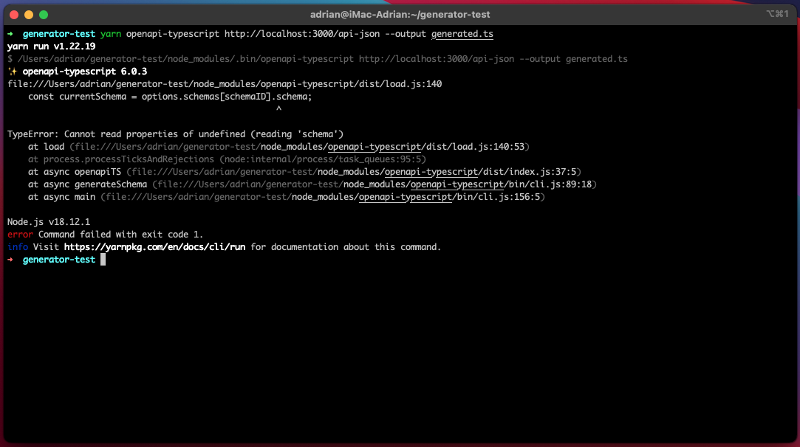
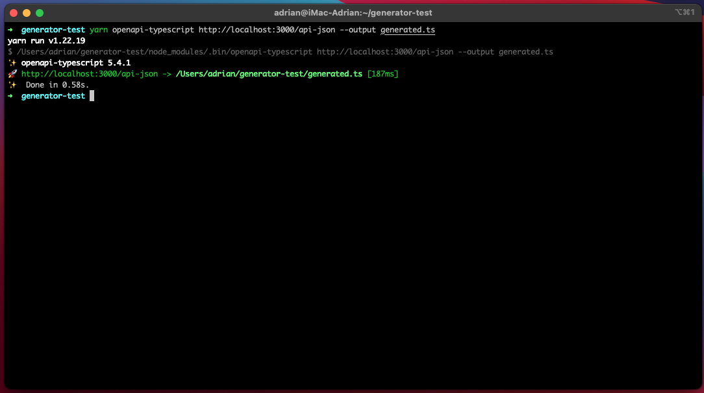

# OpenAPI Typescript Error

This repository is a part of the [openapi-typescript issue](https://github.com/drwpow/openapi-typescript/issues/988).

## Start

To start backend, run the command below:

```bash
yarn start:dev
```

## API Documentation

Swagger UI - [http://localhost:3000/api](http://localhost:3000/api)<br />
OpenAPI - [http://localhost:3000/api-json](http://localhost:3000/api-json)

## Error

6.0.3:


5.4.1:

